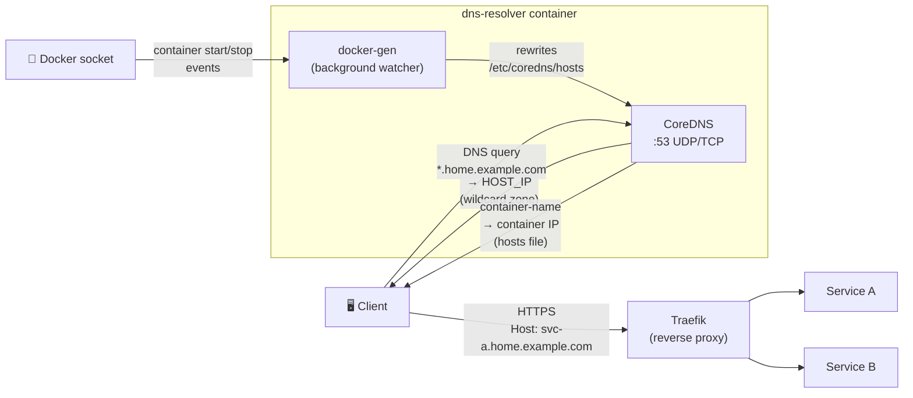
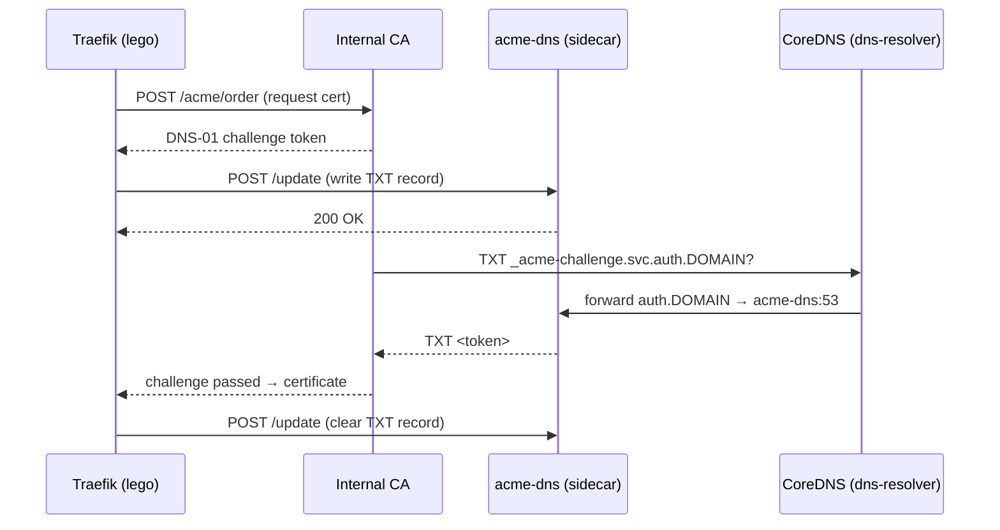

# dns-resolver

[](https://github.com/Circle-RD/dns-resolver/actions/workflows/docker-publish.yml)
[](https://github.com/Circle-RD/dns-resolver/pkgs/container/dns-resolver)
[](LICENSE)

Internal DNS resolver combining **CoreDNS** and **docker-gen** in a single container. Automatically populates DNS entries for every running container and resolves your domain zone to the host IP — ready to pair with Traefik for zero-config service routing.

Configured entirely via **environment variables**. No config file to maintain.

---

## Architecture



> docker-gen watches the Docker socket and rewrites `/etc/coredns/hosts` on every container event (`DOCKERGEN_WAIT` debounce, default 5 s–30 s). CoreDNS reloads the file at `HOSTS_RELOAD` interval (default 15 s), making new containers resolvable within seconds.

---

## Quick start

```bash
# Pull the image
docker pull ghcr.io/circle-rd/dns-resolver:latest

# Or build locally
git clone https://github.com/Circle-RD/dns-resolver.git
cd dns-resolver
docker build -t dns-resolver .
```

Create a `.env` from the template and adjust values:

```bash
cp .env.example .env
$EDITOR .env
docker compose up -d
```

---

## Environment variables

| Variable            | Required | Default   | Description                                                                                  |
| ------------------- | -------- | --------- | -------------------------------------------------------------------------------------------- |
| `DOMAIN`            | **Yes**  | —         | Internal domain zone (e.g. `home.example.com`)                                               |
| `HOST_IP`           | **Yes**  | —         | IP of the host; all `*.DOMAIN` queries resolve to this address                               |
| `DNS_UPSTREAM`      | No       | `1.1.1.1` | Upstream resolver for external queries                                                       |
| `DNS_AUTHORITATIVE` | No       | `true`    | `true` → NXDOMAIN for unknown names; `false` → forward unknowns to upstream                  |
| `ACME_DNS_ENABLED`  | No       | `false`   | Enable ACME DNS-01 support; adds a CoreDNS forward stanza for `auth.DOMAIN` (`true`/`false`) |
| `HOSTS_RELOAD`      | No       | `15s`     | CoreDNS reload interval for `/etc/coredns/hosts`                                             |
| `ZONE_RELOAD`       | No       | `30s`     | CoreDNS reload interval for `/etc/coredns/zone`                                              |
| `DOCKERGEN_WAIT`    | No       | `5s:30s`  | docker-gen debounce interval (default 5 s–30 s)                                              |

> **Note:** `HOST_IP` is typically the IP of the host running the container, but can also be a local IP of a router or other device.

> **Production Tips:** On a docker infrastructure with few containers (stable), `DOCKERGEN=5s:30s` + `HOSTS_RELOAD=15s` is recommended. On a very dynamic infrastructure with many containers (unstable), `DOCKERGEN=1s:5s` + `HOSTS_RELOAD=5s` is recommended.

### Authoritative vs split-horizon

| `DNS_AUTHORITATIVE` | Unknown subdomain under `DOMAIN` | External query              |
| ------------------- | -------------------------------- | --------------------------- |
| `true` (default)    | `NXDOMAIN`                       | Forwarded to `DNS_UPSTREAM` |
| `false`             | Forwarded to `DNS_UPSTREAM`      | Forwarded to `DNS_UPSTREAM` |

Use `false` for split-horizon DNS — the zone is served locally, but unknown subdomains fall through to your upstream resolver.

---

## ACME DNS-01 challenge

When paired with an internal CA ([step-ca](https://smallstep.com/docs/step-ca/), [Vault PKI](https://developer.hashicorp.com/vault/docs/secrets/pki), …) and Traefik, dns-resolver can serve the `_acme-challenge` TXT records required by the **DNS-01 challenge**, enabling fully automatic certificate issuance without exposing port 80.

### How it works



1. Traefik requests a certificate from the internal CA.
2. The CA issues a DNS-01 challenge: create a TXT at `_acme-challenge.svc.auth.DOMAIN`.
3. Traefik calls the **acme-dns REST API** (`POST /update`) to write the TXT record.
4. The CA queries CoreDNS. Because `ACME_DNS_ENABLED=true`, CoreDNS forwards all `auth.DOMAIN` queries to the `acme-dns` sidecar, which responds with the TXT record.
5. Challenge passes → certificate issued. Traefik cleans up the TXT record.

> CoreDNS uses Docker's internal DNS to resolve the `acme-dns` hostname — no fixed container IP required.

### Setup

**1. Enable in `.env`:**

```env
ACME_DNS_ENABLED=true
```

**2. Keep the `acme-dns` service in your compose** (already included in the example below).

**3. Configure Traefik** (static config + environment variables):

```yaml
# traefik.yml — static configuration
certificatesResolvers:
  internal:
    acme:
      caServer: "https://ca.home.example.com/acme/acme/directory"
      storage: "/data/acme.json"
      dnsChallenge:
        provider: acmedns
        resolvers:
          - "<HOST_IP>:53"
```

```yaml
# In the Traefik service environment block:
environment:
  - ACMEDNS_STORAGE_PATH=/data/acmedns.json # credentials per domain (auto-created)
  - ACMEDNS_API_BASE=http://acme-dns:80 # acme-dns REST API (internal)
```

> Traefik must share the `dns-net` network with `acme-dns` to reach its REST API.

**First-time registration** — on first certificate request, the `acmedns` lego provider automatically calls `POST /register` on acme-dns and saves the per-domain credentials to `ACMEDNS_STORAGE_PATH`. Subsequent renewals are fully automatic.

### Testing

```bash
# Register a domain and obtain credentials manually
curl -s -X POST http://<HOST_IP or service name>:80/register | jq .
# → { "username": "...", "password": "...", "fulldomain": "<uuid>.auth.home.example.com", ... }

# Verify the TXT query reaches acme-dns via CoreDNS
dig @<HOST_IP> _acme-challenge.test.auth.home.example.com TXT +short
```

---

## docker-compose example

> Requires Docker Compose CLI **v2.24+** for the inline `configs.content` interpolation.

```yaml
volumes:
  acme_dns_data:

configs:
  acme_dns_config:
    content: |
      [general]
      listen = "0.0.0.0:53"
      protocol = "both"
      domain = "auth.${DOMAIN}"
      nsname = "acme-dns.${DOMAIN}"
      nsadmin = "hostmaster.${DOMAIN}"
      debug = false

      [database]
      engine = "sqlite3"
      connection = "/var/lib/acme-dns/acme-dns.db"

      [api]
      ip = "0.0.0.0"
      port = "80"
      tls = "none"
      disable_registration = false
      autoregister = false
      use_header = false

      [logconfig]
      loglevel = "info"
      logtype = "stdout"
      logformat = "text"

networks:
  dns-net:
    name: dns-net

services:
  dns:
    image: ghcr.io/circle-rd/dns-resolver:latest
    container_name: dns
    restart: unless-stopped
    ports:
      - "${HOST_IP}:53:53/udp"
      - "${HOST_IP}:53:53/tcp"
    environment:
      - DOMAIN=${DOMAIN}
      - HOST_IP=${HOST_IP}
      - DNS_UPSTREAM=${DNS_UPSTREAM:-1.1.1.1}
      - DNS_AUTHORITATIVE=${DNS_AUTHORITATIVE:-true}
      - ACME_DNS_ENABLED=${ACME_DNS_ENABLED:-false}
      - HOSTS_RELOAD=${HOSTS_RELOAD:-15s}
      - ZONE_RELOAD=${ZONE_RELOAD:-30s}
      - DOCKERGEN_WAIT=${DOCKERGEN_WAIT:-5s:30s}
    volumes:
      - /var/run/docker.sock:/var/run/docker.sock:ro
    networks:
      - dns-net

  # Optional — remove if ACME DNS-01 is not needed.
  acme-dns:
    image: joohoi/acme-dns:latest
    container_name: acme-dns
    restart: unless-stopped
    configs:
      - source: acme_dns_config
        target: /etc/acme-dns/config.cfg
    volumes:
      - acme_dns_data:/var/lib/acme-dns
    networks:
      - dns-net
```

> Binding port 53 to `${HOST_IP}` instead of `0.0.0.0` avoids conflicts with `systemd-resolved` on Linux hosts.

---

## Testing

**Verify the wildcard zone resolves to HOST_IP:**

```bash
dig @<HOST_IP> anything.home.example.com +short
# → <HOST_IP>
```

**Verify container name resolution:**

```bash
# With a running container named "myapp":
dig @<HOST_IP> myapp +short
# → <container-IP>
```

**Verify external resolution still works:**

```bash
dig @<HOST_IP> github.com +short
# → (public IP)
```

**Traefik integration — route a service:**

```yaml
# In the service container labels:
labels:
  - "traefik.enable=true"
  - "traefik.http.routers.myapp.rule=Host(`myapp.home.example.com`)"
```

Point your client's DNS to `HOST_IP`, then open `https://myapp.home.example.com` — Traefik receives the request via the wildcard zone and routes it by the `Host()` header.

---

## Multi-arch support

The published image supports the following platforms:

| Platform       | Architecture                             |
| -------------- | ---------------------------------------- |
| `linux/amd64`  | x86-64 servers, VMs                      |
| `linux/arm64`  | ARM64 (Apple M\*, AWS Graviton, RPi 4/5) |
| `linux/arm/v7` | ARMv7 (Raspberry Pi 2/3)                 |

Docker will automatically pull the correct variant for your host.

---

## How it works

1. On startup, `entrypoint.sh` validates `DOMAIN` and `HOST_IP`, then generates:
   - `/etc/coredns/Corefile` — CoreDNS configuration via `envsubst`
   - `/etc/coredns/zones/db.<DOMAIN>` — authoritative SOA / NS / A / wildcard zone file
   - `/etc/coredns/hosts` — empty seed file, populated at runtime

2. **docker-gen** starts in the background, watches `/var/run/docker.sock`, and rewrites `/etc/coredns/hosts` on every container start or stop (`DOCKERGEN_WAIT` debounce, default `5s:30s`).

3. **CoreDNS** starts and serves:
   - `*.DOMAIN` → `HOST_IP` (wildcard zone, Traefik routes by `Host()` header)
   - Container names → container IPs (via hosts file, reloaded every `HOSTS_RELOAD`, default `15s`)
   - All other queries → upstream resolver (default: `1.1.1.1`)

4. Both processes run under the same entrypoint script. A shared `trap` on `SIGTERM`/`SIGINT` ensures a clean shutdown of both processes when the container stops.

---

## License

MIT — see [LICENSE](LICENSE).
