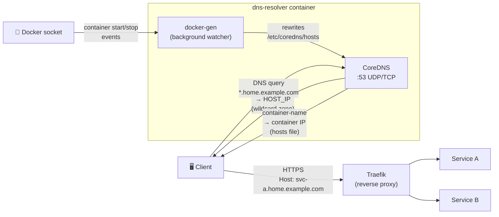

# Introduction

**DNS Resolver** is a single-container internal DNS server that combines two tools:

- **[CoreDNS](https://coredns.io/)** (v1.12) — the DNS server. Serves a static wildcard zone for your internal domain and a dynamic hosts file for per-container name resolution.
- **[docker-gen](https://github.com/nginx-proxy/docker-gen)** — a file template processor that watches the Docker socket. On every container start or stop, it rewrites `/etc/coredns/hosts`, making CoreDNS aware of new containers within seconds.

The container is configured entirely via environment variables. The entrypoint (`entrypoint.sh`) generates both the Corefile and the zone file from templates at startup — no manual file editing is required.

## What it does

- Serves a wildcard A record: every `*.your.domain` query resolves to `HOST_IP`
- Automatically adds a hosts-file entry for each running container (name → container IP)
- Forwards all external queries to a configurable upstream resolver (default: `1.1.1.1`)
- Optionally returns `NXDOMAIN` for unknown subdomains (authoritative mode) or forwards them upstream (split-horizon mode)
- Optionally proxies `auth.DOMAIN` to an `acme-dns` sidecar for DNS-01 ACME challenge support

## What it does NOT do

- It does not terminate TLS — certificate management is left to Traefik or another reverse proxy
- It does not persist DNS records — the hosts file is regenerated from the live Docker state on every container event
- It does not require any manual configuration after initial environment setup

## Architecture



> docker-gen watches the Docker socket and rewrites `/etc/coredns/hosts` on every container event (`DOCKERGEN_WAIT` debounce, default `5s:30s`). CoreDNS reloads the file at `HOSTS_RELOAD` interval (default `15s`), making new containers resolvable within seconds.

## Where it fits

DNS Resolver is designed for **private home labs and internal networks** where you want:

1. A single internal domain (e.g. `home.example.com`) that routes all traffic through Traefik
2. Automatic DNS registration for every running Docker container
3. Optional internal certificate issuance without a public CA

```
Client → DNS Resolver :53 → wildcard *.home.example.com → HOST_IP
                                                          → Traefik (routes by Host header)
                                                              → Service A
                                                              → Service B
```

## Technology stack

| Component  | Version      | Role                                                                 |
| ---------- | ------------ | -------------------------------------------------------------------- |
| CoreDNS    | 1.12         | DNS server — zone file, hosts file, forwarding                      |
| docker-gen | latest       | Docker socket watcher — rewrites hosts file on container events     |
| Alpine     | 3.21         | Container base image                                                 |
| gettext    | (Alpine pkg) | `envsubst` — substitutes env vars into Corefile and zone templates  |
| Shell      | POSIX sh     | `entrypoint.sh` — generates config, starts both processes           |
