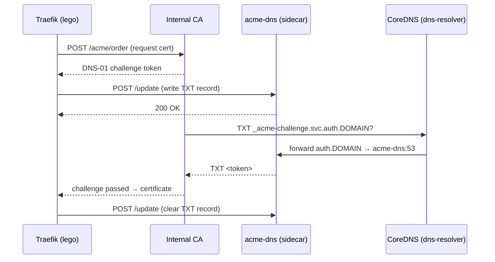

# ACME DNS-01 Challenge

When `ACME_DNS_ENABLED=true`, DNS Resolver forwards all `auth.DOMAIN` queries to an `acme-dns` sidecar container, enabling the **DNS-01 ACME challenge** flow. This allows Traefik (or any ACME client using lego) to automatically issue certificates from an internal CA without exposing port 80.

## How it works



1. Traefik requests a certificate from the internal CA via ACME.
2. The CA issues a DNS-01 challenge: create a TXT record at `_acme-challenge.<service>.auth.DOMAIN`.
3. Traefik calls the **acme-dns REST API** (`POST /update`) to write the TXT record.
4. The CA queries CoreDNS. Because `ACME_DNS_ENABLED=true`, CoreDNS forwards all `auth.DOMAIN` queries to the `acme-dns` sidecar, which responds with the TXT record.
5. The challenge passes and the CA issues the certificate. Traefik cleans up the TXT record.

> CoreDNS uses Docker's internal DNS to resolve the `acme-dns` hostname — no fixed container IP is required.

## Setup

### 1 — Enable in your `.env`

```ini
ACME_DNS_ENABLED=true
```

### 2 — Add the `acme-dns` sidecar to your compose

The `acme-dns` sidecar must be on the same Docker network (`dns-net`) as DNS Resolver.

The `configs.content` block below requires **Docker Compose CLI v2.24+**.

```yaml
volumes:
  acme_dns_data:

configs:
  acme_dns_config:
    content: |
      [general]
      listen = "0.0.0.0:53"
      protocol = "both"
      domain = "auth.${DOMAIN}"
      nsname = "acme-dns.${DOMAIN}"
      nsadmin = "hostmaster.${DOMAIN}"
      debug = false

      [database]
      engine = "sqlite3"
      connection = "/var/lib/acme-dns/acme-dns.db"

      [api]
      ip = "0.0.0.0"
      port = "80"
      tls = "none"
      disable_registration = false
      autoregister = false
      use_header = false

      [logconfig]
      loglevel = "info"
      logtype = "stdout"
      logformat = "text"

networks:
  dns-net:
    name: dns-net

services:
  dns:
    image: ghcr.io/circle-rd/dns-resolver:latest
    environment:
      - DOMAIN=${DOMAIN}
      - HOST_IP=${HOST_IP}
      - ACME_DNS_ENABLED=true
    volumes:
      - /var/run/docker.sock:/var/run/docker.sock:ro
    ports:
      - "${HOST_IP}:53:53/udp"
      - "${HOST_IP}:53:53/tcp"
    networks:
      - dns-net

  acme-dns:
    image: joohoi/acme-dns:latest
    container_name: acme-dns
    restart: unless-stopped
    configs:
      - source: acme_dns_config
        target: /etc/acme-dns/config.cfg
    volumes:
      - acme_dns_data:/var/lib/acme-dns
    networks:
      - dns-net
```

### 3 — Configure Traefik

Add a `dnsChallenge` certificate resolver in Traefik's static configuration:

```yaml
# traefik.yml — static configuration
certificatesResolvers:
  internal:
    acme:
      caServer: "https://ca.home.example.com/acme/acme/directory"
      storage: "/data/acme.json"
      dnsChallenge:
        provider: acmedns
        resolvers:
          - "${HOST_IP}:53"
```

Add the acmedns provider environment to the Traefik service:

```yaml
# Traefik service in compose
environment:
  - ACMEDNS_STORAGE_PATH=/data/acmedns.json   # per-domain credentials (auto-created on first run)
  - ACMEDNS_API_BASE=http://acme-dns:80        # acme-dns REST API (internal Docker network)
```

> Traefik must share the `dns-net` network with `acme-dns` to reach its REST API at `http://acme-dns:80`.

### 4 — First-time registration

On the first certificate request, the `acmedns` lego provider automatically calls `POST /register` on acme-dns and saves the per-domain credentials to `ACMEDNS_STORAGE_PATH`. Subsequent renewals are fully automatic.

You can trigger registration manually to verify the setup:

```bash
curl -s -X POST http://<HOST_IP>:80/register | jq .
# → { "username": "...", "password": "...", "fulldomain": "<uuid>.auth.home.example.com", ... }
```

## Testing

Verify that TXT queries reach acme-dns via CoreDNS:

```bash
# Should return an empty or non-existent TXT record (no challenge active)
dig @${HOST_IP} _acme-challenge.test.auth.home.example.com TXT +short

# Write a test TXT record manually
curl -s -X POST http://<HOST_IP>:80/update \
  -H "Content-Type: application/json" \
  -d '{"username":"<UUID>","password":"<PASSWORD>","subdomain":"<UUID>","txt":"test-value"}'

# Verify CoreDNS forwards the query to acme-dns and returns the TXT record
dig @${HOST_IP} _acme-challenge.<UUID>.auth.home.example.com TXT +short
# → "test-value"
```
